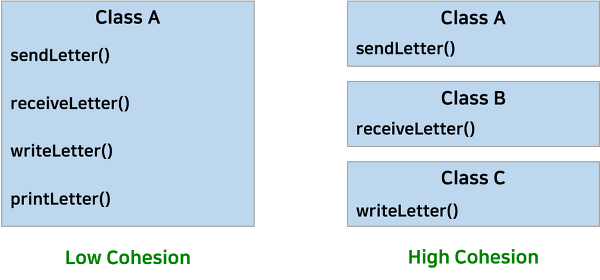

# Object Oriented Programming

<br>

## Coupling, Cohesion

하나의 모듈 혹은 모듈간의 상호작용 정도를 나타내는 개념이다. 즉, 클래스부터 함수 하나 하나 작성할 때 까지 적용될 수 있는 개념이라도 보면 된다. 즉, 결합도는 두 모듈간의 상호작용 정도를, 그리고 응집도는 하나의 모듈 내에서의 상호작용 정도를 말한다고 볼 수 있다.  

실무를 하다보면, 유지보수와 리팩토링 시 필수적으로 따라오는 개념이다. 이 두 개념을 고려하지 않으면, 미래에 내가 짠 코드를 누군가가, 심지어 나조차도 수정하기 힘들게 될 수 있다. 그러니 **높은 응집도, 낮은 결합도** 를 지향하는 마음가짐을 꼭 꼭 지닌채 프로그램을 짜야한다!

<br>

### 결합도 (Coupling)

한 요소가 다른 요소와 얼마나 연결되어 있는가, 또 얼마나 의존적인가를 나타내는 정도.

#### 결합도가 높은 구조의 문제점

- 연관된 클래스가 변경되면 다른 클래스를 변경해야 한다.
- 한 클래스를 수정하기 위하여, 다른 클래스를 이해해야 한다.

#### 결합도 종류

(결합도의 종류를 일일이 기억하고 암기하려 하기 보다는, 예시를 보면서 자연스럽게 느낌을 가져가는 것이 좋다고 생각한다. 자료마다 결합도의 종류에 따른 예시가 다르고, 부정확한 경우도 많고, 종류마다의 명확한 정의를 내리는 것도 분명하지는 않기 때문.)

참고 : [[위키백과] 결합도](https://ko.wikipedia.org/wiki/%EA%B2%B0%ED%95%A9%EB%8F%84])

#### 예시

##### High Coupling

``` Java
class Manager {

	SmartWorker sw;
	LazyWorker lw;

	public Manager(SmartWorker sw, LazyWorker lw) {
		this.sw = sw;
		this.lw = lw;
	}

	public void ManageWork() {
		sw.work();
		lw.work();
	}
}

class SmartWorker {
	public void work() {
		System.out.println("smart worker working");
	}
}

class LazyWorker {
	public void work() {
		System.out.println("Lazy worker working");
	}
}

public class Test {

	public static void main(String[] args) {
		SmartWorker sw = new SmartWorker();
		LazyWorker lw = new LazyWorker();
		Manager mn = new Manager(sw, lw);
		mn.ManageWork();
	}
}
```

만약 여기에 ExtraordinaryWorker 도 추가하고 싶다면, Test와 Manager 클래스에변경을 필수적으로 가해야 할 것이다. manageWork()의 방식에서 Manager와 SmartWorker, LazyWorker 간의 결합도가 상당히 높기 때문이다.

##### Loose Coupling

``` Java

class Manager {

	IWorker worker;
	public Manager(IWorker worker) {
		this.worker=worker;
	}

	public void ManageWork() {	
		this.worker.work();
	}
}

interface IWorker{
	void work();
}

class SmartWorker implements IWorker{
	public void work() {
		System.out.println("smart worker working");
	}
}

class LazyWorker implements IWorker {
	public void work() {
		System.out.println("Lazy worker working");
	}
}

class ExtraordinaryWorker implements IWorker{
	public void work() {
		System.out.println("ExtraOrdinary worker working");
	}
}

public class Test {

	public static void main(String[] args) {
		SmartWorker sw = new SmartWorker();
		Manager mn = new Manager(sw);
		mn.ManageWork();
		
		LazyWorker lw = new LazyWorker();
		Manager mn2 = new Manager(lw);
		mn2.ManageWork();
		
		ExtraordinaryWorker ew = new ExtraordinaryWorker();
		Manager mn3 = new Manager(ew);
		mn3.ManageWork();
	}
}
```

기존에 가지고 있던 결합성을 인터페이스의 활용을 통해서 해결했다.


두 모양 중에 오른쪽의 결합도 모양을 갖춘 오브젝트가 더 많은 이점이 존재한다. 우선적으로 프로젝트의 규모가 커지게 되면, 변경사항이 생기는데 그 변경사항의 범위를 줄일 수 있으며 일부만 영향을 받게할 수 있기 때문이다. 가장 처음에 말했듯이 프로젝트가 한번 구현 끝내고 이후에 유지보수를 하지 않는 것은 일회용품을 만들겠다는 소리이다. 더불어서 왼쪽보다 오른쪽이 테스터하기에 더 적합하다. 왼쪽은 서로의 오브젝트가 긴밀하게 결합되어 있기 때문에 작은 단위의 테스트라도 많은 과정을 거치는 반면에 오른쪽은 그렇지 않다. 결과적으로 결합도를 낮추었기 때문에 변경이 용이하다. [출처](https://pasudo123.tistory.com/31 [unique individuals])

<br>

### 응집도 (Cohesion)

한 요소가 해당 기능을 수행하기 위하여 얼마나 뭉쳐있는가를 나타내는 정도. 프로그램을 쉽게 이해할 수 있게 되어, 유지보수가 쉬워진다. 

#### 예시

'아메리카노를 만드는' 함수가 있다고 치자. 이 함수에는 (1)에스프레소 샷을 내리고 (2)*물*을 컵에 담고 (3)에스프레소를 컵에 따르는 행위가 모두 한 함수에 담겨 있다고 하자. 이때, 만약 '라뗴를 만드는' 함수를 새로 만든다면, (1)에스프레소 샷을 내리고 (2')*우유*를 컵에 담고 (3)에스프레소를 컵에 따르는 행위의 함수를 새로 만들어야 한다. 즉, (1)과 (3)의 행위가 겹치는데 그를 재사용하지 못하고 '라떼를 만드는' 함수에 새로이 작성해야 하는 것이다. 만약 (1), (2), (3) 함수를 따로 만들어 '아메리카노를 만드는' 함수를 작성했다면, '라떼를 만든는' 함수는 기존의 (1), (3) 함수어와 새로만든 (2') 함수로 쉽게 만들어낼 수 있을 것이다.

#### 응집도 낮으면 문제점

- 이해, 재사용, 유지보수 하기 힘들다.

#### 응집도가 높은 클래스

- 인스턴스 변수의 수가 적다
- 각 메소드는 인스턴스 변수를 하나 이상 사용해야 한다
- 메소드가 인스턴스 변수를 많이 사용할 수록 응집도가 높다. 

#### 응집도가 무조건 높으면 좋은가?

- 응집도가 매우 높은 클래스는 가능하지도 않고, 바람직하지도 않다.
- 코드 생산에 너무 많은 비용이 소모
- 유사한 비용이라면 응집도가 높은 것이 필요



<br>

### Related Link

[[Swift OOP] 결합도와 응집도](https://www.youtube.com/watch?v=FFqm_GgGcBg) 

[높은 응집도 & 낮은 결합도](https://pasudo123.tistory.com/31)

[Loose coupling and tight coupling in java – Comparison Example](https://www.interviewsansar.com/2018/03/24/loose-coupling-and-tight-coupling-in-java/)